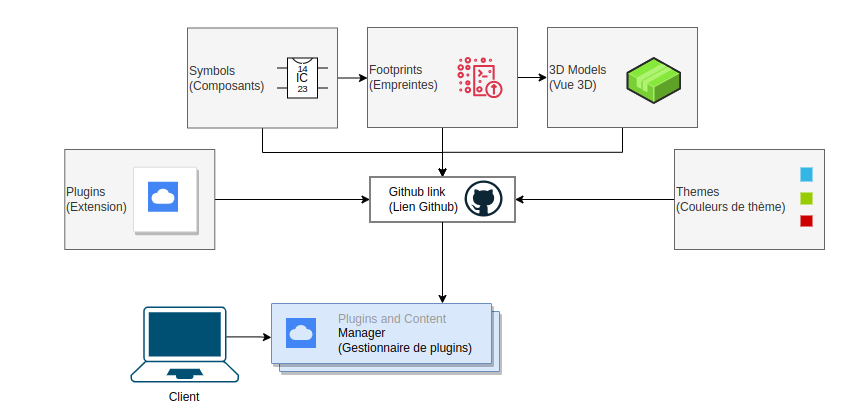
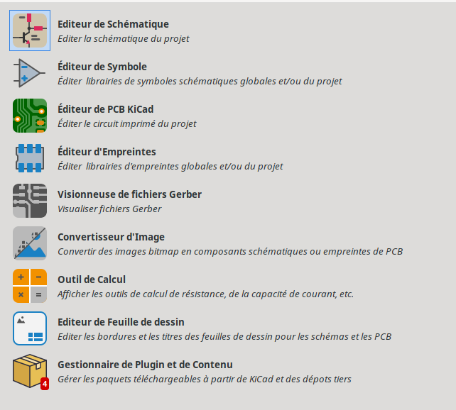
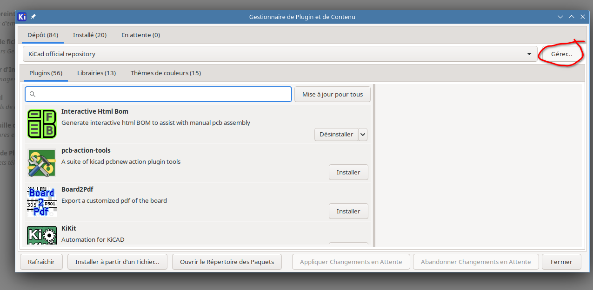
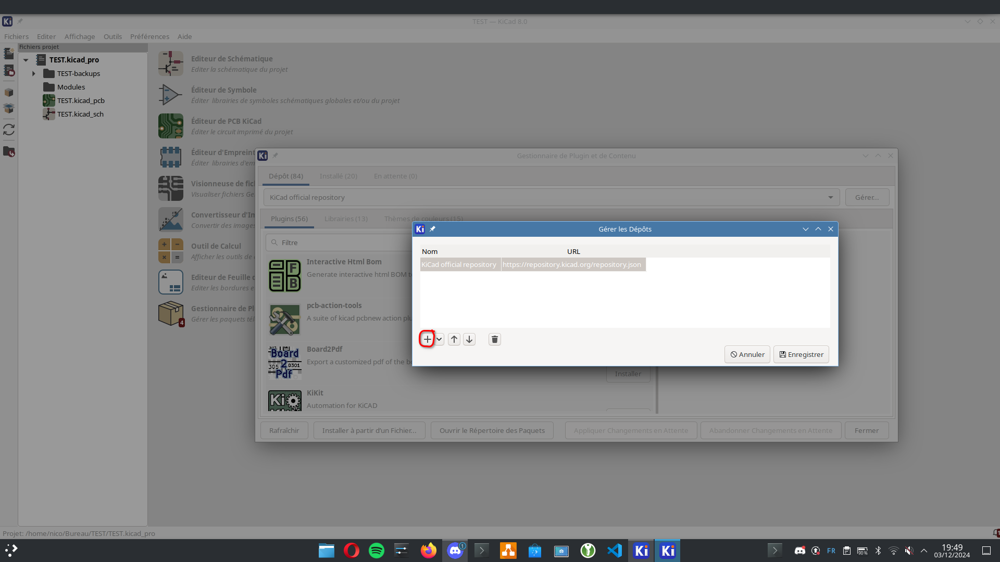
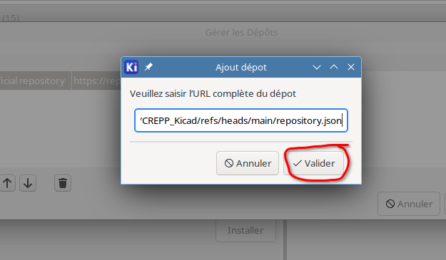
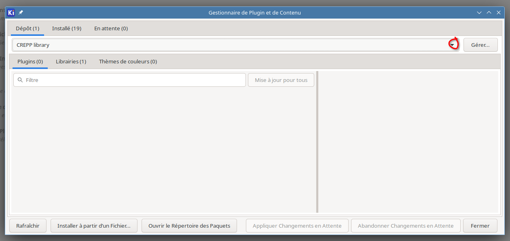
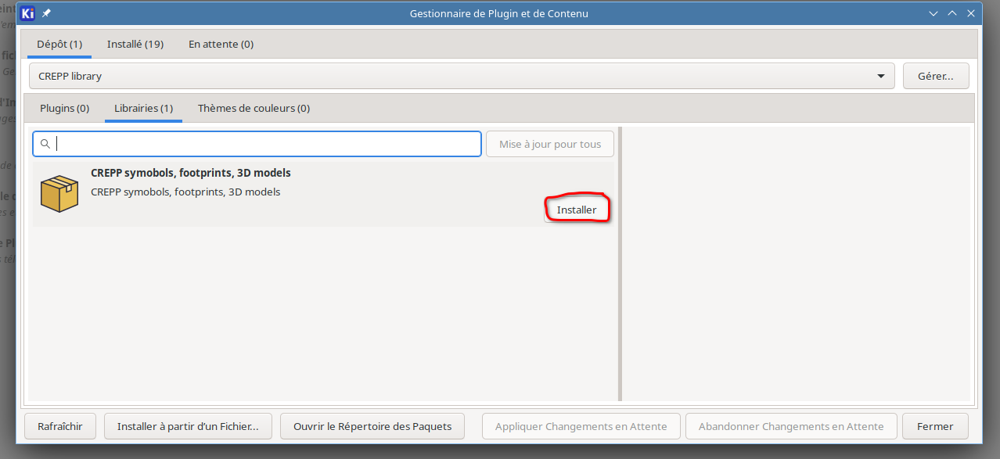

# Organisation de la bibliothèque

# Installation d'une bibliothèque via le PCM de KiCad

Ce tutoriel explique comment installer une bibliothèque à partir d'un fichier JSON via le Plugin and Content Manager (PCM) de KiCad.

## Pré-requis

- Avoir installé **KiCad 8** ou une version compatible avec le PCM.
- Disposer de l'adresse du fichier JSON de la bibliothèque :  
  `https://raw.githubusercontent.com/CREPP-PLOEMEUR/CREPP_Kicad/refs/heads/main/repository.json`

---

## Étape 1 : Ouvrir le Plugin and Content Manager (PCM)

1. Lancez **KiCad**.
2. Dans le menu principal, cliquez sur **Preferences** > **Manage Plugins**.

---

## Étape 2 : Ajouter un dépôt personnalisé

1. Dans la fenêtre du PCM, cliquez sur l'onglet **Gérer**.

2. Cliquez sur le bouton **Add** pour ajouter un nouveau dépôt.

---

## Étape 3 : Saisir l'URL du dépôt

1. Collez l'adresse suivante dans le champ dédié :  
   `https://raw.githubusercontent.com/CREPP-PLOEMEUR/CREPP_Kicad/refs/heads/main/repository.json`
2. Cliquez sur **OK** pour valider.

3. Puis faire **Enregistrer**

---

## Étape 4 : Mettre à jour les bibliothèques

1. Sélectionnez la bibliothèque **Kicad_repository** dans la liste déroulante

2. Cliquez sur le bouton **Plugins** puis **Installer**

